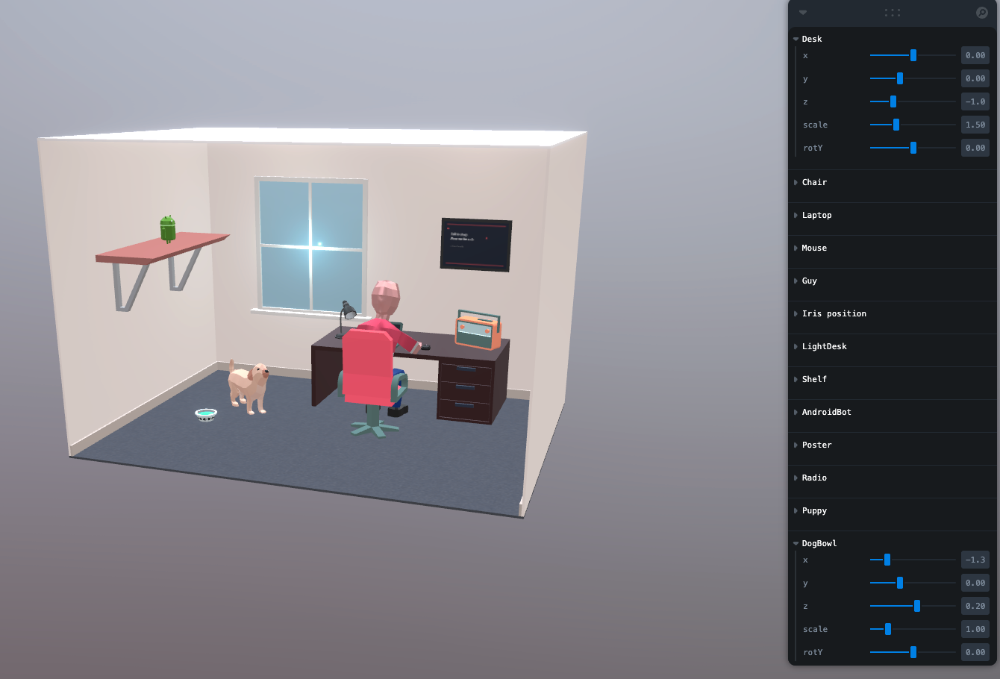

# 3D Interactive Office Experience



**[Live Demo](https://psandis.github.io/office-3d-exp/)**

A browser-based 3D scene built with React Three Fiber — think AAA game lobby meets portfolio website. Visitors land in a living, animated 3D environment that feels like walking into a game level, not browsing a webpage.

## Features

- Interactive 3D objects with hover glow, click animations, and particle effects
- Cinematic camera system with auto-orbit and smooth dolly transitions
- Post-processing stack (bloom, depth of field, vignette, SSAO)
- Floating particles and ambient life — nothing is static
- Sound design for hover, click, and ambient atmosphere
- Spring physics for satisfying, weighted interactions

## Tech Stack

| Layer | Tool |
|-------|------|
| 3D Engine | React Three Fiber |
| Scene Helpers | @react-three/drei |
| Animation | @react-spring/three |
| Post-Processing | @react-three/postprocessing |
| State | Zustand |
| Build | Vite |
| 3D Models | Blender → glTF/GLB (Draco) |

## Architecture

Each scene object is a self-contained module (like a microservice) owning its own 3D model, animations, shaders, sounds, and interaction logic. Objects are currently placeholders — content gets wired in later.

See [VISION.md](VISION.md) for the full design vision and implementation roadmap.

## Getting Started

```bash
npm install
npm run dev
```
